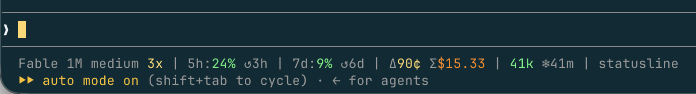

# @mourner/claudefiles

Two small [Claude Code](https://claude.com/claude-code) efficiency tools:

- **statusline** — a cost & context-efficiency status line. A standalone bash script
  (plugins can't ship a `statusLine`, so this one installs via a settings snippet).
- **guard** — a `PreToolUse` hook that blocks context-wasting tool calls and nudges
  toward scoped alternatives. Shipped as an installable plugin.

Both work unmodified across Pro/Max seat, enterprise, and API-key billing.

## statusline

[`statusline/statusline-command.sh`](statusline/statusline-command.sh) — a custom status line for efficiency-conscious sessions. Example:



Reading left to right:

| Group | Segment | Meaning |
| --- | --- | --- |
| model | `Fable 1M` | model, with context-window size |
| | `medium` | effort level |
| | `3x` | roughly how much this model+effort costs per prompt, relative to Opus at low effort (the 1x baseline) |
| limits | `5h:16% ↺2h` | 5-hour rate limit: used, and time until it resets (only when the account reports it) |
| | `7d:2% ↺3d` | weekly rate limit: used, and time until it resets |
| cost | `Δ10¢` | this turn's cost — starts at zero each prompt and climbs as the turn runs |
| | `Σ$14.90` | session cost so far |
| context | `169k` | context tokens in use |
| | `❄4m` | time left before the prompt cache expires — past it, the next turn pays full price to rebuild it instead of the 0.1x cached read |
| cwd | `claudefiles` | working directory |

Costs come from the session transcript at public **API list prices** — on a flat-rate seat
the dollar figures are notional, not what you're billed. The prompt-cache TTL is detected
from actual usage.

Requires `bash` and `jq`.

### Install

Add to `settings.json`:

```json
{
  "statusLine": {
    "type": "command",
    "command": "bash ~/path/to/claudefiles/statusline/statusline-command.sh",
    "refreshInterval": 5
  }
}
```

## guard

A single [`hooks/guard.mjs`](hooks/guard.mjs) that runs before every `Read`, `Bash`,
`WebFetch`, and `LSP` call. When it recognizes a pattern that needlessly burns context, it
blocks the call and returns a one-line reason pointing at the better tool.

It only blocks patterns it's sure about. Anything it can't parse, a file it can't read, or
an unexpected error all let the call through — the guard never blocks a call it doesn't
understand, so a bug in it can't bring your work to a halt.

### What it blocks

| Tool | Pattern blocked | Why / what to do instead |
| --- | --- | --- |
| Bash | tree-wide `grep`/`rg` for a symbol-looking pattern | Scans the whole tree. Scope it: `grep -n foo src/`. |
| Bash | `cat`/`sed`/`awk`/`head`/`tail` of a code/JSON file | Use the Read tool — Edit needs a prior Read, so a `cat` only forces a duplicate read later. |
| Bash | a `grep`/read at a path that doesn't exist | A blind guess. `find`/`ls` to locate it first. |
| Bash | `find … -exec cat {}` | Dumps every matched file whole. Read the ones you need. |
| Bash | reading gated files in a `for`/`while` loop | Dumps each matched file whole. Read the ones you need. |
| Bash | `git show <ref>:<path>` of a large file | Dumps the whole file. Read the part you need. |
| Bash | two-dot `git diff A..B` | Compares endpoints, folding in unrelated changes. Use three-dot `A...B` (from the merge-base). |
| Read | a code/JSON file over 16 KB, with no `limit` | Pulls the whole file. Pass a `limit` to scope the read. |
| WebFetch | a GitHub issue/PR/blob page | Noisy rendered HTML. Use the `gh` CLI or `raw.githubusercontent.com`. |
| LSP | `workspaceSymbol`, or `documentSymbol` on a large file | Dumps the whole symbol table/tree. Use `grep`/`findReferences`. (Dormant unless an LSP plugin is enabled.) |

The 16 KB size gate and the list of gated extensions are constants at the top of
[`hooks/guard.mjs`](hooks/guard.mjs) — edit them there if your codebase wants different limits.

### Install (plugin)

```
/plugin marketplace add mourner/claudefiles
/plugin install claudefiles@mourner
```

### Install (manual hook)

If you'd rather not use the plugin, point a `PreToolUse` hook at the script directly in
`~/.claude/settings.json`:

```json
{
  "hooks": {
    "PreToolUse": [
      {
        "matcher": "Read|Bash|WebFetch|LSP",
        "hooks": [
          { "type": "command", "command": "node \"$HOME/path/to/claudefiles/hooks/guard.mjs\"" }
        ]
      }
    ]
  }
}
```

This machine-wide guard stacks with any per-repo `.claude/hooks/guard.mjs`: Claude Code runs
every matching hook on a call and blocks it if any one of them does.
