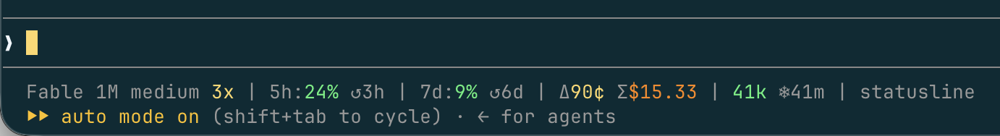

# claudefiles

A few small [Claude Code](https://claude.com/claude-code) efficiency tools:

- **statusline** — a cost & context-efficiency status line, a standalone bash script.
- **guard** — a small `PreToolUse` hook that blocks the few tool calls that clearly waste a
  lot of context or answer the wrong question.
- **js-perf-notes** — a skill: a reference of transferable JavaScript/V8 performance
  optimization principles, auto-consulted when profiling or optimizing hot code.

The guard and skill ship as the installable `claudefiles` plugin (with more tooling to come);
statusline installs via a one-line settings snippet, since plugins can't ship a `statusLine`.

## statusline

[`statusline/statusline-command.sh`](statusline/statusline-command.sh) — a custom status line for efficiency-conscious sessions. Example:



Reading left to right:

| Group | Segment | Meaning |
| --- | --- | --- |
| model | `Fable 1M` | model, with context-window size |
| | `medium` | effort level |
| | `3x` | roughly how much this model+effort costs per prompt, relative to Opus at low effort (the 1x baseline) |
| limits | `5h:16% ↺2h` | 5-hour rate limit: used, and time until it resets (only when the account reports it) |
| | `7d:2% ↺3d` | weekly rate limit: used, and time until it resets |
| | `⚠1.4x` | burn-rate pace — appears next to a limit only when you're spending too fast to last until its reset (see below) |
| cost | `Δ10¢` | this turn's cost — starts at zero each prompt and climbs as the turn runs |
| | `Σ$14.90` | session cost so far |
| context | `169k` | context tokens in use |
| | `❄4m` | time left before the prompt cache expires — past it, the next turn pays full price to rebuild it instead of the 0.1x cached read |
| cwd | `claudefiles` | working directory |

**Costs** come from the session transcript at public API list prices — on a flat-rate seat
the dollar figures are *notional*, not what you're billed. They still track the *relative*
weight of what you're doing — which turns are expensive, what a model or effort change costs —
so they work as an efficiency signal even with no money on the line. The prompt-cache TTL is
detected from actual usage.

**Burn-rate pace** (`⚠1.4x`) is `used% ÷ elapsed%` for a limit's window: `1.0x` is dead on a
linear budget line, so `1.4x` means you'll hit the wall before reset if you keep the pace.
Each limit gets its own badge, and it stays hidden unless worth acting on — only above `1.1x`,
and never in a window's first 10% (`PACE_WARN` / `PACE_FLOOR` in the script).

**Colors** run green → cyan → orange → red across segments, signaling fine → worth a glance.
The cost multiplier, rate limits, tokens, cache TTL, and pace badge each carry their own
thresholds, so a red anywhere is the one thing to look at.

Requires `bash` and `jq`.

### Install

Add to `settings.json`:

```json
{
  "statusLine": {
    "type": "command",
    "command": "bash ~/path/to/claudefiles/statusline/statusline-command.sh",
    "refreshInterval": 5
  }
}
```

## guard

A single [`hooks/guard.mjs`](hooks/guard.mjs) that runs before every `Read`, `Bash` and
`WebFetch` call. When it recognizes a call that would clearly burn context or answer the
wrong question, it blocks it and returns a one-line reason naming the alternative.

It only blocks patterns it's sure about. Anything it can't parse, a file it can't read, or
an unexpected error all let the call through — the guard never blocks a call it doesn't
understand, so a bug in it can't bring your work to a halt.

### What it blocks

| Tool | Pattern blocked | Why / what to do instead |
| --- | --- | --- |
| Bash | `cat` of a file over 64 KB, unpiped and unredirected | Goes straight into context. Filter it (`grep`, `jq`, `head`) or read a slice. |
| Bash | two-dot `git diff A..B` | Compares endpoints, folding in unrelated changes. Use three-dot `A...B` (from the merge-base). |
| Read | a file over 64 KB, with no `limit`/`offset` | Pulls the whole file. Pass a `limit` to scope the read. |
| WebFetch | a GitHub issue/PR/blob page | Noisy rendered HTML. Use the `gh` CLI or `raw.githubusercontent.com`. |

The 64 KB ceiling is a constant at the top of [`hooks/guard.mjs`](hooks/guard.mjs) — edit it
there if your work wants a different limit.

### Install (plugin)

```
/plugin marketplace add mourner/claudefiles
/plugin install claudefiles@mourner
```

### Install (manual hook)

If you'd rather not use the plugin, point a `PreToolUse` hook at the script directly in
`~/.claude/settings.json`:

```json
{
  "hooks": {
    "PreToolUse": [
      {
        "matcher": "Read|Bash|WebFetch",
        "hooks": [
          { "type": "command", "command": "node \"$HOME/path/to/claudefiles/hooks/guard.mjs\"" }
        ]
      }
    ]
  }
}
```

This machine-wide guard stacks with any per-repo `.claude/hooks/guard.mjs`: Claude Code runs
every matching hook on a call and blocks it if any one of them does.

## js-perf-notes (skill)

[`skills/js-perf-notes/SKILL.md`](skills/js-perf-notes/SKILL.md) — a distilled,
project-agnostic reference of JavaScript/V8 performance-optimization principles: a profiling
loop, headless tooling (`flamebearer`, `--trace-deopt`), benchmarking against noise, and
honest reporting. Bottleneck-specific V8 techniques (inlining budgets, SMI range, hidden
classes, cache/memory layout) live in on-demand files under `skills/js-perf-notes/techniques/`.
It's a *reference to consult*, not a workflow to run — Claude pulls it in on its own when a
task is about profiling or optimizing hot code.

### Install (plugin)

Ships with the `claudefiles` plugin (see the guard install above) — no extra step.

### Install (manual symlink)

If you'd rather not use the plugin, symlink the skill into your personal skills directory:

```
mkdir -p ~/.claude/skills
ln -s ~/path/to/claudefiles/skills/js-perf-notes ~/.claude/skills/js-perf-notes
```
